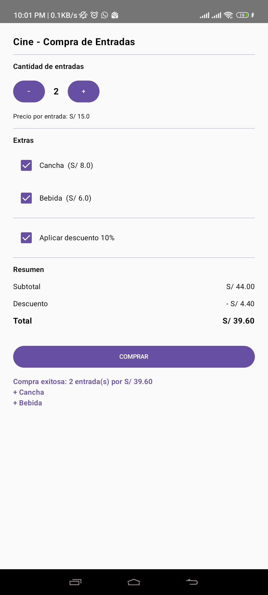

# Cine - Compra de Entradas

App Android hecha con Jetpack Compose (Kotlin) que simula la compra de entradas de cine.

## DESCRIPCION

- Elegir cantidad de entradas (mínimo 1), a S/ 15.00 cada una.
- Agregar extras: Cancha (S/ 8.00) y Bebida (S/ 6.00).
- Aplicar 10% de descuento si se marca la casilla.
- Ver resumen: subtotal, descuento y total.
- El botón COMPRAR muestra un mensaje con el total.

## EXPLICACION

- Con Kotlin, Jetpack Compose y Material 3.
- El estado (cantidad, extras, descuento, mensaje) se guarda con `remember`.
- Los cálculos se hacen con `val` según lo que el usuario elige.
- La pantalla usa Column, Row, Button, Checkbox y Text.
- Al presionar COMPRAR se muestra el mensaje en pantalla.

## INTEGRANTES: GRUPO N° 3

- BARRIOS/MEDINA, MATHIAS ALONSO
- GALLEGOS/CONDORI, ANETTE ISABEL
- NINA/CALIZAYA, RAFAEL DIEGO
- RAMIREZ/CCAHUANA, MAX EDU
- RIVEROS/VALERIANO, SEBASTIAN ALFREDO

